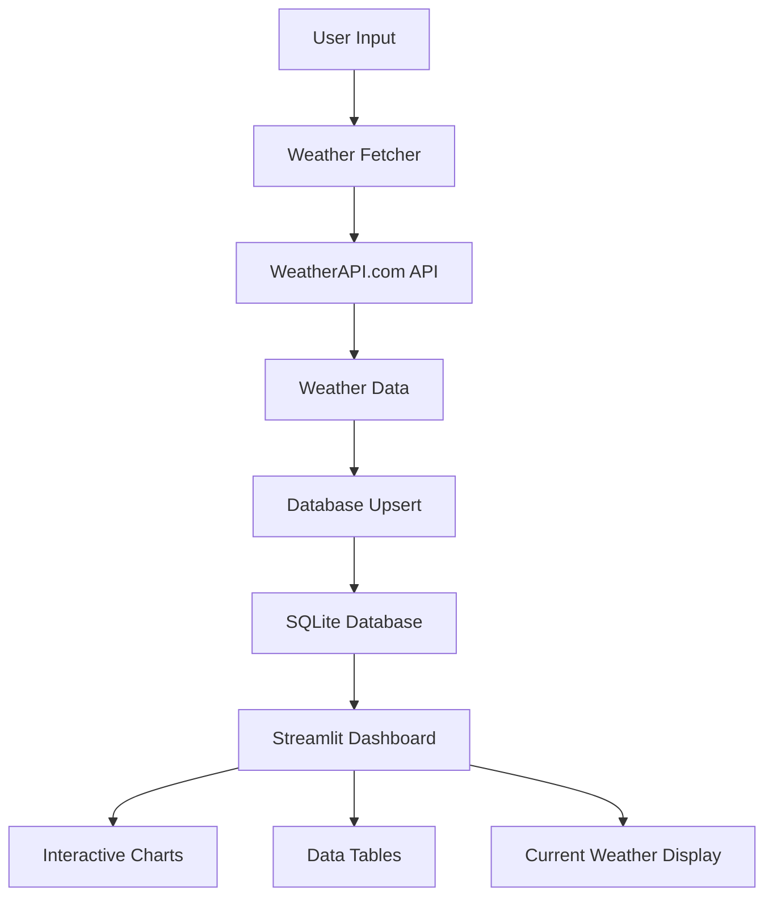

# Weather API Pipeline with Data Visualization

A complete weather data pipeline that fetches current weather data from WeatherAPI.com, stores it in SQLite database, and provides beautiful visualizations through a Streamlit dashboard.

## 🌟 Features

- **Weather Data Fetching**: Retrieve current weather data for any location using WeatherAPI.com
- **Data Storage**: Store weather data in SQLite database with automatic upsert functionality
- **Beautiful Dashboard**: Interactive Streamlit web application with real-time weather display
- **Historical Analysis**: Track weather trends over time with interactive charts
- **Comprehensive Testing**: Full test coverage for all components
- **Data Model**: Well-designed database schema with entity-relationship diagram

## 🚀 Quick Start

### 1. Prerequisites

- Python 3.13+
- WeatherAPI.com API key (free at [weatherapi.com](https://www.weatherapi.com/signup.aspx))

### 2. Installation

```bash
# Install dependencies
pip install -r requirements.txt
# or with uv
uv sync
```

### 3. Environment Setup

Create a `.env` file in the `demo-example` directory:

```env
WEATHER_API_KEY=your_api_key_here
```

### 4. Run the Streamlit Dashboard

```bash
cd demo-example
streamlit run streamlit_app.py
```

The dashboard will open in your browser at `http://localhost:8501`

## 📁 Project Structure

```
demo-example/
├── weather_fetcher.py          # Weather API client
├── weather_database.py         # SQLite database operations
├── weather_pipeline.py         # Integration layer
├── streamlit_app.py            # Web dashboard
├── weather_data_model.md       # Database schema documentation
├── test_weather_fetcher.py     # Tests for API client
├── test_weather_database.py    # Tests for database operations
├── todo-list.md               # Project checklist ✅
└── README.md                  # This file
```

## 🔧 Usage

### Command Line Interface

```python
# Fetch and store weather data
from weather_pipeline import fetch_and_store_weather

record_id, was_inserted, weather_data = fetch_and_store_weather("London,UK")
print(f"Weather data stored with ID: {record_id}")
```

### Batch Processing

```python
from weather_pipeline import batch_weather_update

locations = ["London,UK", "New York,US", "Tokyo,JP"]
results = batch_weather_update(locations)

for result in results:
    if result['success']:
        print(f"✅ {result['location']}: {result['weather_data']['temperature']['current']}°C")
    else:
        print(f"❌ {result['location']}: {result['error']}")
```

### Database Queries

```python
from weather_database import WeatherDatabase

db = WeatherDatabase()

# Get latest records
recent_records = db.get_latest_weather_records(10)

# Get records for specific location
london_records = db.get_weather_by_location("London", "GB")

# Get database statistics
stats = db.get_database_stats()
print(f"Total records: {stats['total_records']}")
```

## 🌐 Streamlit Dashboard Features

### Current Weather Display
- **Weather Icon**: Visual representation of current conditions
- **Temperature**: Current, feels-like, min/max temperatures
- **Atmospheric Data**: Humidity, pressure, wind speed/direction
- **Cloud Coverage**: Percentage of cloud cover

### Interactive Controls
- **Location Input**: Search any city worldwide
- **Unit Selection**: Metric, Imperial, or Kelvin
- **Auto-refresh**: Automatic data updates every 30 seconds
- **Fetch Button**: Manual weather data retrieval

### Historical Analysis
- **Temperature Trends**: Line charts showing temperature over time
- **Weather Metrics**: Multi-axis charts for humidity and pressure
- **Database Statistics**: Record counts and date ranges
- **Data Table**: Sortable table of all weather records

## 🗄️ Database Schema

The project uses a well-designed SQLite database with two main tables:

### Weather Records Table
- Stores all weather data points
- Includes temperature, humidity, pressure, wind data
- Timestamps for historical tracking

### Locations Table
- Lookup table for unique locations
- Tracks record counts and date ranges
- Optimizes queries and provides statistics

See `weather_data_model.md` for the complete Entity-Relationship diagram.

## 🧪 Testing

Run the test suite:

```bash
# Run all tests
pytest

# Run specific test file
pytest test_weather_fetcher.py -v

# Run with coverage
pytest --cov=. --cov-report=html
```

### Test Coverage
- **Weather Fetcher**: API calls, error handling, data parsing
- **Database Operations**: CRUD operations, upsert functionality, queries
- **Integration Tests**: End-to-end pipeline testing
- **Mock Tests**: Isolated unit testing without API dependencies

## 📊 Data Flow



## 🛠️ API Reference

### WeatherFetcher
```python
fetcher = WeatherFetcher()
weather_data = fetcher.fetch_current_weather("London,UK", units="metric")
```

### WeatherDatabase
```python
db = WeatherDatabase("weather_data.db")
record_id = db.insert_weather_record(weather_data)
record_id, was_inserted = db.upsert_weather_record(weather_data)
```

### WeatherPipeline
```python
pipeline = WeatherPipeline("weather_data.db")
record_id, was_inserted, weather_data = pipeline.fetch_and_store_weather("London,UK")
```

## 🔄 Error Handling

The system includes comprehensive error handling:

- **API Failures**: Graceful handling of network issues and invalid responses
- **Database Errors**: Transaction rollbacks and connection management
- **Invalid Input**: User-friendly error messages for malformed location strings
- **Rate Limiting**: Built-in delays to respect API rate limits

## 📈 Performance Considerations

- **Database Indexing**: Optimized indexes for fast location and time-based queries
- **Connection Pooling**: Efficient database connection management
- **Caching**: Upsert logic prevents duplicate recent records
- **Batch Processing**: Support for bulk weather data collection

## 🤝 Contributing

1. Fork the repository
2. Create a feature branch
3. Add tests for new functionality
4. Ensure all tests pass
5. Submit a pull request

## 📝 License

This project is licensed under the MIT License - see the LICENSE file for details.

## 🙏 Acknowledgments

- [WeatherAPI.com](https://www.weatherapi.com/) for providing the weather API
- [Streamlit](https://streamlit.io/) for the amazing web framework
- [Plotly](https://plotly.com/) for interactive charts
- [SQLite](https://sqlite.org/) for the reliable database engine

## 🆘 Troubleshooting

### Common Issues

1. **API Key Error**: Ensure your WeatherAPI.com API key is correctly set in the `.env` file
2. **Database Locked**: Close any database connections before running tests
3. **Module Not Found**: Make sure you're in the correct directory and dependencies are installed
4. **Streamlit Port Conflict**: Use `streamlit run streamlit_app.py --server.port 8502` to change port

### Support

For questions or issues, please check the test files for usage examples or create an issue in the repository. 