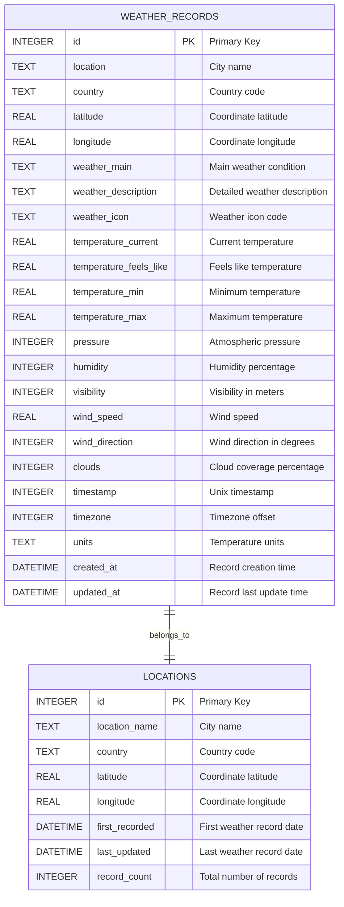

# Weather Data Model

## Database Schema Diagram

## Table Descriptions

### WEATHER_RECORDS
The main table storing all weather data records. Each record represents a weather snapshot at a specific location and time.

### LOCATIONS
A lookup table for unique locations, providing summary information and statistics about each location.

## Data Relationships
- Each weather record belongs to one location
- Locations can have multiple weather records over time
- The relationship helps optimize queries and provides location-based analytics

## Indexing Strategy
- Primary indexes on id fields
- Composite index on (location, country) for fast location lookups
- Index on timestamp for time-based queries
- Index on created_at for recent data queries 