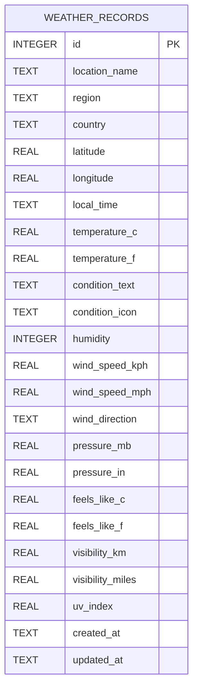

# Weather Data Model

## Mermaid Diagram

## Database Schema

The `WEATHER_RECORDS` table will store all weather data points with the following structure:

- **id**: Primary key, auto-incrementing integer
- **location_name**: Name of the location (e.g., "London")
- **region**: Region/state information
- **country**: Country name
- **latitude/longitude**: Geographic coordinates
- **local_time**: Local time at the location when data was fetched
- **temperature_c/temperature_f**: Current temperature in Celsius and Fahrenheit
- **condition_text**: Weather condition description (e.g., "Partly cloudy")
- **condition_icon**: URL to weather condition icon
- **humidity**: Humidity percentage
- **wind_speed_kph/wind_speed_mph**: Wind speed in different units
- **wind_direction**: Wind direction (e.g., "WSW")
- **pressure_mb/pressure_in**: Atmospheric pressure in different units
- **feels_like_c/feels_like_f**: "Feels like" temperature in different units
- **visibility_km/visibility_miles**: Visibility distance in different units
- **uv_index**: UV index value
- **created_at**: Timestamp when record was first created
- **updated_at**: Timestamp when record was last updated

## Index Strategy

- Primary index on `id` (automatic)
- Index on `location_name` for fast location-based queries
- Index on `created_at` for time-based queries
- Composite index on `location_name, created_at` for location-time queries 